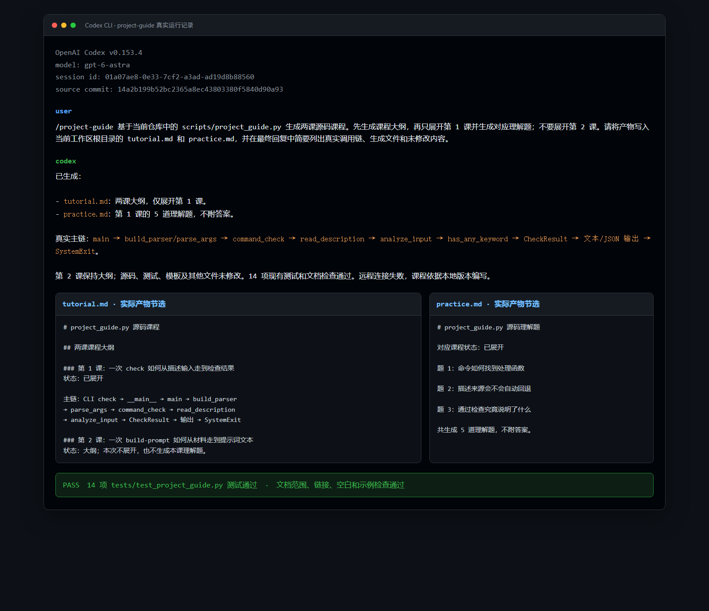

# `/project-guide` 源码课程真实运行案例

本目录记录一次真实的 Codex CLI 运行。Agent 使用 PR 提交 `14a2b199b52bc2365a8ec43803380f5840d90a93` 中的 `/project-guide`，读取同一提交的 `scripts/project_guide.py`，实际生成 [tutorial.md](tutorial.md) 与 [practice.md](practice.md)。



## 运行环境

- Codex CLI：`0.153.4`
- 模型：`gpt-6-astra`
- 源码提交：`14a2b199b52bc2365a8ec43803380f5840d90a93`
- 运行结果：生成两课大纲，只展开第 1 课，并生成第 1 课理解题
- 验证结果：`tests/test_project_guide.py` 现有 14 项测试通过；文档范围、链接、空白、冲突标记及课程示例检查通过

归档到 `docs/` 后，仅将产物中的源码相对链接调整为当前目录可访问的仓库内相对路径，课程正文与题目未改写。

## 用户输入

```text
/project-guide 基于当前仓库中的 scripts/project_guide.py 生成两课源码课程。先生成课程大纲，再只展开第 1 课并生成对应理解题；不要展开第 2 课。请将产物写入当前工作区根目录的 tutorial.md 和 practice.md，并在最终回复中简要列出真实调用链、生成文件和未修改内容。
```

## Agent 最终回复

```text
已生成：

- tutorial.md：两课大纲，仅展开第 1 课。
- practice.md：第 1 课的 5 道理解题，不附答案。

真实主链：main → build_parser/parse_args → command_check → read_description → analyze_input → has_any_keyword → CheckResult → 文本/JSON 输出 → SystemExit。

第 2 课保持大纲；源码、测试、模板及其他文件未修改。14 项现有测试和文档检查通过。远程连接失败，课程依据本地版本编写。
```
